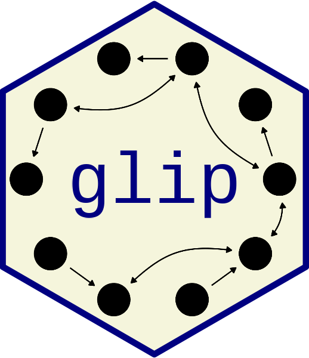

# Graph Learning via Integer Programming in R 

The **glip** package [1] provides global optimization-based algorithms for
learning (causal) graphical models from data, including Directed Acyclic Graphs
(DAGs), Acyclic Directed Mixed Graphs (ADMGs), and chain graphs (CGs). The
package relies on mixed-integer programming via GUROBI [2] for accurate,
constraint-based graph learning, with advanced support for latent variables and
complex causal graphs.

## Features

- Learn DAGs, ADMGs, DMGs, CGs directly from observational or interventional data
- Global graph optimization powered by integer programming (requires GUROBI)
- Supports various conditional independence tests (including tests from
[**comets**](https://github.com/LucasKook/comets.git) [3], `pcalg`, and `bnlearn`)
- Parallel execution for heavy workloads

## Installation

**CRAN release:** (Not yet available)

**Development version** via GitHub (requires R >= 4.1):
```r
# Install remotes if not present
# install.packages("remotes")
remotes::install_github("LucasKook/glip")
```

The **RBGL** package (a **pcalg** dependency) is available through Bioconductor:
```r
if (!require("BiocManager", quietly = TRUE))
    install.packages("BiocManager")

BiocManager::install("RBGL")
```

### GUROBI Dependency

This package uses [GUROBI Optimizer](https://www.gurobi.com/) (commercial, free
for academic use) for solving mixed-integer problems crucial for global graph
learning. You must [install
](https://www.gurobi.com/documentation/quickstart.html), obtain a valid
license, and install the `gurobi` R package by following the instructions in [2].

## Quick Start Example

Learn a causal graph from toy continuous data:

```r
library("glip")

### Set seed for reproducibility
set.seed(1)

### Generate some toy data from: Y <- X -> Z
n <- 500
X <- rnorm(n)
Y <- X + rnorm(n)
Z <- X + rnorm(n)
data <- data.frame(X = X, Y = Y, Z = Z)

# Learn a DAG (using Gaussian CI test from `pcalg`)
result <- learn_graph(data, max_size = 1, mode = "dag", test = "gaussCItest", comets = FALSE)

# Inspect the learned DAG
result$graph

# Inspect the essential graph
result$computed
```

## Supported Modes

- `"dag"`: Directed Acyclic Graph (standard causal Bayesian Network)
- `"dg"`: Directed Graph (allows for cycles, used d-separation and hence assumes normal distribution)
- `"admg"`: Acyclic Directed Mixed Graph (allows for hidden confounding)
- `"dmg"`: Directed Mixed Graph (possibly cyclic)
- `"chain"`: LWF-chain graphs
- Additional experimental modes

## Reproducibility

To reproduce the results from the paper, please follow the following instructions:

1. Clone this GitHub repository

2. Download Download and install [clingo](https://github.com/potassco/clingo)
   to `./inst/asp/`, unzip the code from [4] to run the ASP solver there.

2. Install the [**dagma**](https://github.com/kevinsbello/dagma) and
   [**CausalDisco**](https://github.com/CausalDisco/CausalDisco) Python
   libraries in a conda environment called `"glip"``.

3. Install the **glip** package and GUROBI following the instructions above.

To reproduce the timing comparison against ASP, run `./inst/code/run-asp-comparison.R`.

To reproduce the simulation study, run `./inst/code/run-simulation.R`.

To reproduce the comparison on benchmark datasets, run
`./inst/code/run-benchmark-datasets.R`.

To reproduce the chain graph simulation, run
`./inst/code/run-chain-graph-simulation.R`.

The above experiments are time consuming (about 7 days CPU time on a high
performance cluster), which is why the scripts above contain default values
that make computation faster, but correspond only to a small fraction of
experiments that were actually run. The shell scripts in `./inst/slurm/`
reproduce all results. Code to produce the figures and tables follows the same
naming conventions as above, replacing `run` with `vis`.

## References

[1] Kook, L., Mogensen, S. W. Exact Graph Learning via Integer Programming.
arXiv preprint arXiv:2601.20589, 2026.
[doi:10.48550/arXiv.2601.20589](https://doi.org/10.48550/arXiv.2601.20589)

[2] [Gurobi Documentation](https://www.gurobi.com/documentation/)

[3] Kook, L. & Lundborg A. R. Algorithm-agnostic significance testing
in supervised learning with multimodal data. Briefings in Bioinformatics 25(6)
2024. [doi:10.1093/bib/bbae475](https://doi.org/10.1093/bib/bbae475)

[4] A. Hyttinen, F. Eberhardt, and M. Järvisalo. Constraint-based causal
discovery: Conflict resolution with answer set programming. In Proceedings of
the 30th Conference on Uncertainty in Artificial Intelligence (UAI), 2014.

## Troubleshooting

- **Error: “Solver gurobi not available.”**
  → Ensure GUROBI and the `gurobi` R package are installed and licensed on your system.

- **Parallel execution**
  Some functions accept `parallel = TRUE` and `ncores` arguments for faster computation.

- **Raise issues or suggest features:**
  Please use [GitHub Issues](https://github.com/LucasKook/glip/issues).
